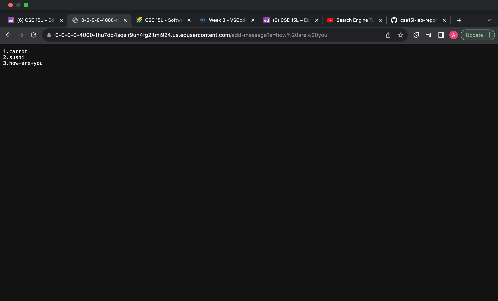
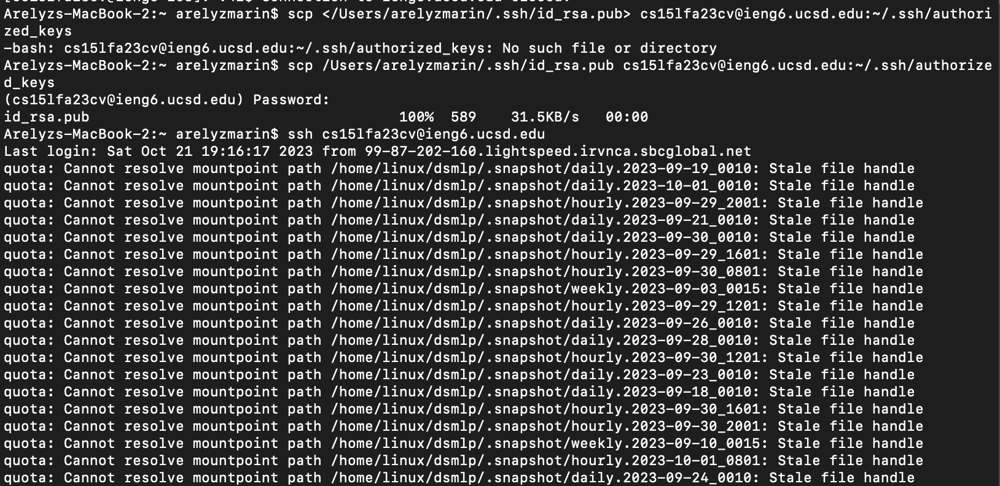

The method called here is handleRequest. In this method I have multiple if statements that run according to the specific path and query inputed by the user.
In this method, one relative argument that the user must add to the URL include "/", which outputs "Use /add-message to output a string.
Another argument is "/add-message" which tells the server that a query will be given. After that, the compiler checks for the argument "?s="
to store the strig following the equal sign. After the equal sign will be a string and that string is stored in variable s. S continues to change
as the user cotinues to add strings in the query. In the first example, we see that s= carrot is added to the variable s. Then, the url is ran with s= sushi
and "sushi" is added to the variable s. Finally, the url is ran with s= how are you, and the string "how are you" is added to the variable s. After these three strings are added,
we output s and it is outputted as three different strings with a newline in between them. Additionally, the variable num is updated (increased) each time a new argument is ran 
with the url. This leads to 1, 2. and 3 being outputted in front of each string. 

The path to the private and public key for my SSH key for logging into ieng6 

The terminal interaction logging into ieng6 with my course-specific account without being asked for a password.
