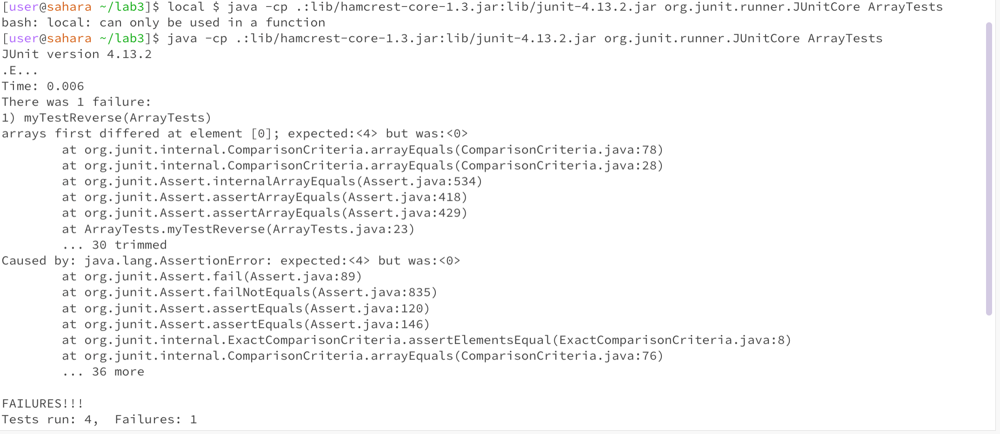
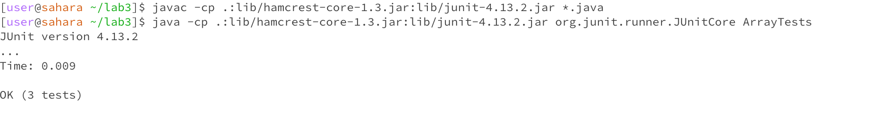

This is the method being tested for my lab3:
```java

  static int[] reversed(int[] arr){
 int[] newArray = new int[arr.length];
 for(int i = 0; i< arr.length; i+=1){
     arr[i] = newArray[arr.length - i - 1];
  }
  return arr;
 }
```

 

1. A failure-inducing input for the buggy program, as a JUnit test and any associated code
```java
      @Test
  public void myTestReverse() {
    int[] input1 = {1,2,3,4};
    int[] expected = {4,3,2,1};
    assertArrayEquals(expected, ArrayExamples.reversed(input1));
  }
```
   
2. An input that doesn’t induce a failure, as a JUnit test and any associated code
```java
     @Test
  public void myTestReverseSuccess() {
    int[] input1 = {0,0,0,0};
    int[] expected ={0,0,0,0};
    assertArrayEquals(expected, ArrayExamples.reversed(input1));
  }
```

   
3. The symptom, as the output of running the tests
   
   
   
4. The bug, as the before-and-after code change required to fix it
   Before:
   ```java
   static int[] reversed(int[] arr) {
    int[] newArray = new int[arr.length];
    for(int i = 0; i < arr.length; i += 1) {
      arr[i] = newArray[arr.length - i - 1];
    }
    return arr;
    }
   ```
   After:
   
```java
  static int[] reversed(int[] arr) {
    int[] newArray = new int[arr.length];
    for(int i = 0; i < arr.length; i += 1) {
      newArray[i] = arr[arr.length - i - 1];
    }
    return newArray;
   }
  ```

  5. Briefly describe why the fix addresses the issue:
Before, the method reversed was copying the elements from newArray into the inout array arr. Since newArray does not have any elements in it, the for loop was putting 0s in all the indicies.
   Now, reversed is inputting the reverse elemnts of arr into newArray and returning the newArray instead of the old one (arr).

   Grep Commands

   <ins>grep -i "string" <file-name>:</ins>


      ArelyzsMacBook2:biomed arelyzmarin$ grep -i "bMi" 1468-6708-3-1.txt
        between body mass index (BMI) and mortality, controlling
        excess risk for persons with very low BMI, but that persons
        with moderately high BMI had little or no extra risk except
        because few studies have examined the relation of BMI to
        events [ 10 ] . In this paper we study whether BMI at
          BMI was calculated as measured weight in kilograms
          BMI of 18.5 to 24.9; overweight as 25 to 29.9; and
          separately the group with BMI between 18.5 and 20, which
          with BMI. To adjust for possible confounding we chose
          and likely to be related to BMI. Self-reported covariates
          plotted mean adjusted YOL and YHL against BMI, and tested
          for difference among BMI groups using confidence
          the effect size for each measure, comparing each BMI
        smokers. Black women had a higher mean BMI and higher
        percent obese (BMI ≥ 30) than the other three groups. Black
        statistically significant (p <.05) except for BMI and
        significant differences between black and white for BMI,
        the difference in BMI was no longer statistically
        significantly on BMI, BMI>30, weight loss since age 50,
        We next examined the relationship of BMI to YOL and YHL.
        BMI below 18.5, but averaged 6.6 years for women with a BMI
        only discrepancy is for men with BMI < 18.5, a category
        with BMI from 18.5 to 20 would be considered 'normal' by
        increase sample size for those with low BMI, we combined
        the two lower categories, defining underweight as a BMI
        BMI. For each BMI category the mean and its 95% confidence
        between BMI and YOL for BMI above 20. Underweight women
        normal group. The relationship of BMI to YHL for men is
        similar, but differences among BMI groups were not
        to the normal BMI group. The effect sizes are shown in
          et al proposed a desirable BMI o. BMI Body mass index


      
      ArelyzsMacBook2:biomed arelyzmarin$ grep -i "hyPotHesis" 1471-213X-2-1.txt
        hypothesis that a balance exists between serine proteases
        initiated to test this hypothesis 
        neuronal migration. This hypothesis is supported by our
        data support the hypothesis that changes in enzymatic
        on migration, strengthens our hypothesis that this serine

      The grep -i command is a case insensitive search for a word. This command ignores cases and retrieves any variation of the word being searched.
      For example in the first example, grep -i "bMi" the command could have returned sentences with "BMI", "bmi, "bMi",etc.

  <ins>grep -n "string" <file-name>:</ins>

  
  ArelyzsMacBook2:biomed arelyzmarin$ grep -n  "hypothesis" 1471-213X-2-1.txt
37:        hypothesis that a balance exists between serine proteases
40:        initiated to test this hypothesis 
277:        neuronal migration. This hypothesis is supported by our
354:        data support the hypothesis that changes in enzymatic
399:        on migration, strengthens our hypothesis that this serine


ArelyzsMacBook2:911report arelyzmarin$ grep -n  "Canada" chapter-6.txt
125:            Ahmed Ressam, 23, had illegally immigrated to Canada in 1994. Using a falsified
134:                $12,000. Back in Canada, he went about procuring weapons, chemicals, and false
138:                travel documents to enter Canada, Ressam decided to carry out the plan alone. By the
159:                Canada, to Port Angeles, Washington. Ressam planned to drive to Seattle and meet
177:                and then return to Canada. Impressed, Abu Zubaydah asked Ressam to get more genuine
392:                controls on the Canadian border (including stepping up U.S.-Canada cooperation). The
624:                undertaking a Joint Perimeter Defense program with Canada to establish

The grep -n command outputs the line number that the word being searched for is in. 
This helps us find a word in a document without having to read the whole file.

<ins>grep -c "string" <file-name>:</ins>


   ArelyzsMacBook2:911report arelyzmarin$ grep -c "terrorism" chapter-6.txt
  67

  

   ArelyzsMacBook2:911report arelyzmarin$ grep -c "2001" chapter-9.txt
  5


  
The grep -c command returns the amount of lines a word appears in a file. This information could tell you of often occurences or abscences
of words.

<ins>grep -l <string> *:</ins>


   ArelyzsMacBook2:911report arelyzmarin$ grep -l "Bin Laden" *
chapter-11.txt
chapter-13.3.txt
chapter-13.4.txt
chapter-13.5.txt
chapter-6.txt


ArelyzsMacBook2:911report arelyzmarin$ grep -l "Lincoln" *
chapter-13.5.txt
chapter-3.txt


The grep -l command gives us the files that contain the string given. This is useful if we forget which file has the information we need.
Let's say we forgot which chapters discuss Bin Laden. we can use this command to give us the chapters that discuss Bin Laden instead of scanning
through all the files.


<ins>Citation:</ins>

@avi122186, @yashbeersingh42, @meetgor, @simmytarika5, @saurabh1990aror, @anikaseth98, and @nicolasalahmar. “GREP Command in Unix/Linux.” GeeksforGeeks, GeeksforGeeks, 15 Nov. 2022, www.geeksforgeeks.org/grep-command-in-unixlinux/. 
  

   


   
