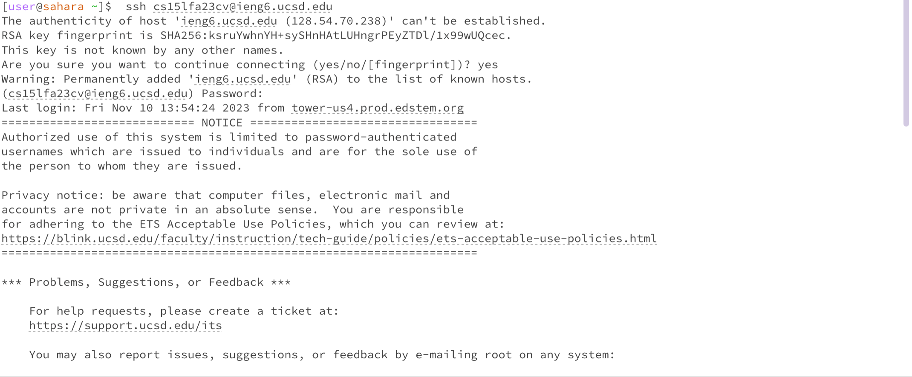
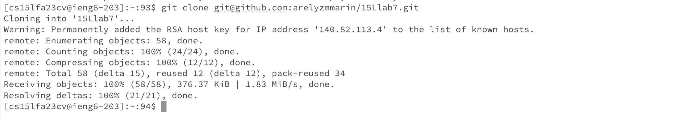
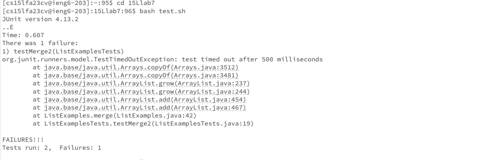
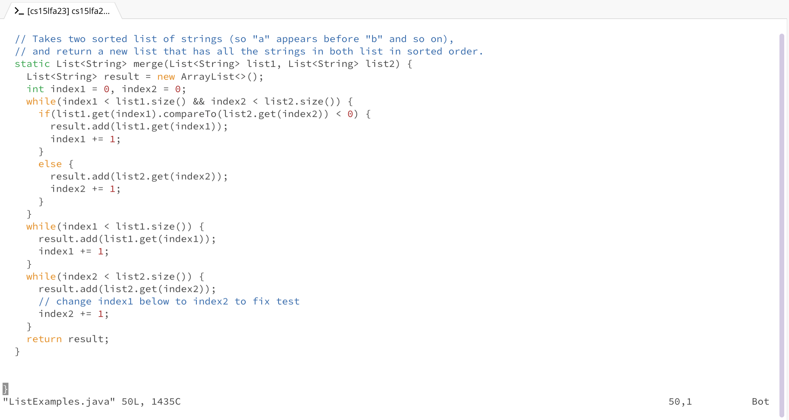
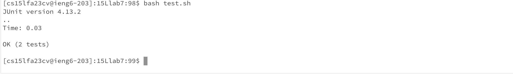
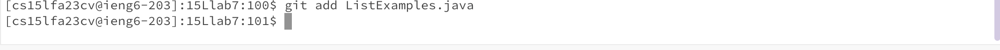
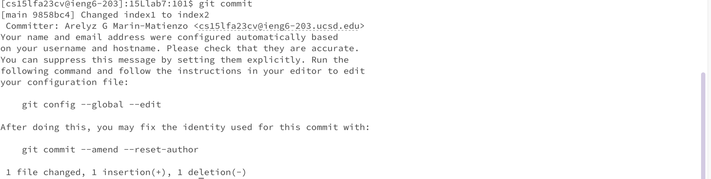

1. Log into ieng6\
   keys pressed:\
   ```
   ssh cs15lfa23cv@ieng6.ucsd.edu <enter>
   yes <enter>
   <type password> <enter>
   ```
   The ssh command is used to switch your terminal's context to running commands on another computer, in this case we are using my course specific CSE15L server. Pressing enter executes this command. I agree to continuing to connect to the server by typing yes and enter. I then type my passsword to my ssh server and press enter to finish the ssh connection.\
   
2. Clone your fork of the repository from your Github account (using the SSH URL)\
   keys pressed:\
   ```
   git clone git@github.com:arelyzmmarin/15Llab7.git <enter>
   ```
   The git clone command downloads the code from the given respository url. Pressing enter executes this command.\
   
3. Run the tests, demonstrating that they fail\
   keys pressed:\
   ```
   cd 15Llab7 <enter>
   bash test.sh <enter>
   ```
   The file I want to run, test.sh, is in a folder called 15Llab7. I used cd to change the current working directory to the given path, cse15Llab7, so that I can access test.sh. Pressing enter executes this command. The bash command runs bash scripts, which are a sequence of commands we could run at the terminal saved in a file. The commands I want to execute in order to compile and run the tests are in the file test.sh. Pressing enter executes this command.\
   
5. Edit the code file ListExamples.java to fix the failing test (as a reminder, the error in the code is just that index1 is used instead of index2 in the final loop in merge)\
   keys pressed:\
   ```
   vim ListExamples.java 
   /index1 <enter>
   N
   e
   x
   i
   2
   <esc>
   :wq!
   ```
   The vim command is used to edit the file ListExamples.java. Pressing enter executes this command and the file ListExamples.java will be opened up in our vim editor and ready for edits to be made. I typed "/index1" and <enter> to tell vim to find all the instances where index1 is found throughout the file. Pressing N gives me the last instance of index1, which is what needs to be changed. Pressing e highlights the last character in the word index1. Pressing x deletes that character; the key i puts us into insert mode on vim, and pressing 2 changes index1 to index2, correcting the test. Pressing the esc key gets the file out of insert mode and back to normal mode. Then I pressed :,w,q, and ! to save and exit from the vim editor. \
   
   
7. Run the tests, demonstrating that they now succeed\
   keys pressed:\
   ```
   bash test.sh <enter>
   ```
   The bash command runs bash scripts, which are a sequence of commands we could run at the terminal saved in a file. The commands I want to run in order to run our tests again are in the file test.sh. Pressing enter executes this command.\
   
9. Commit and push the resulting change to your Github account\
   keys pressed:\
   ```
   Git add ListExamples.java <enter>
   git commit <enter>
   i
   changed index1 to index2
   <esc>
   :wq!
   ```
   The command git add "stages" a file to be part of a commit. Since I made changes to ListExamples.java, I want to add the changes I made to that file in the commit. Pressing enter executes this command. The command git commit saves all changes made to a file and tracks them to github and I press enter to exucute this command. A vim editor opens up and I am able to write a commit message to describe the changes I made. Pressing the i key puts the file in insert mode so that I can write a message. I wrote the message "changed index1 to index2" then pressed esc to go into normal mode on vim. I pressed :, w, q, and ! to save and quit the vim file.
   
   
   
