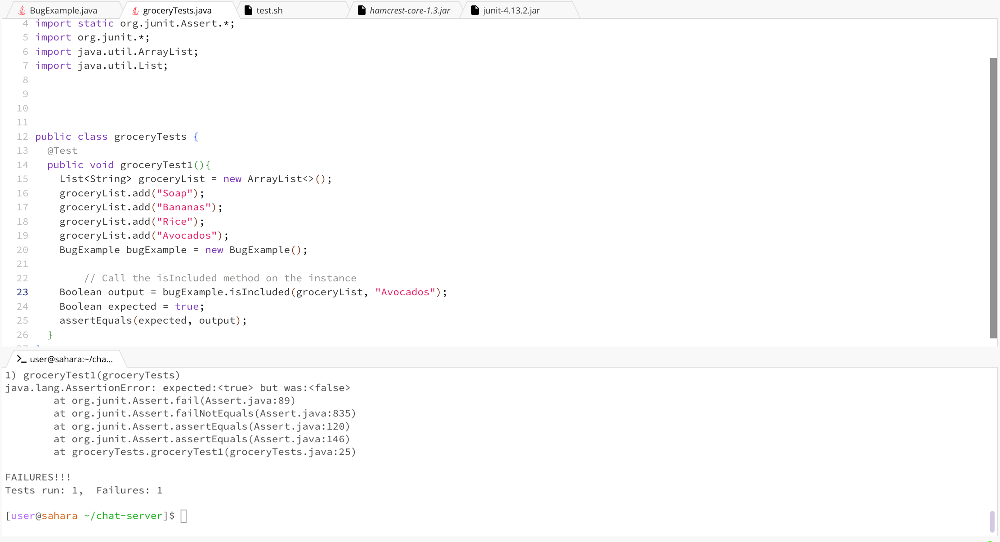
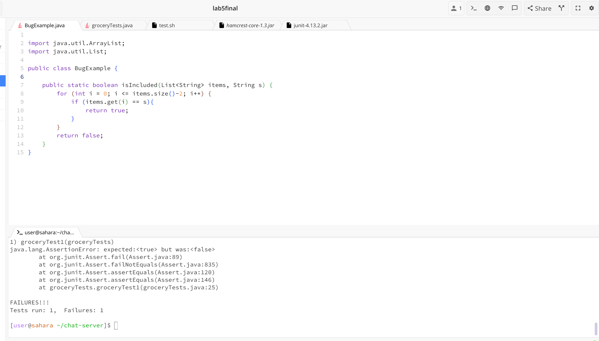
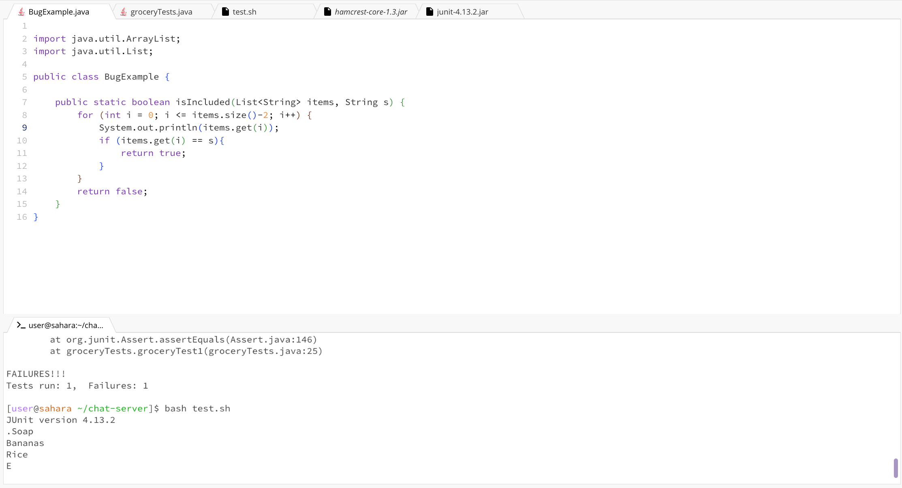

Part 1 – Debugging Scenario
1. Student: Hello, I am having trouble with my code. I made a code that would tell me if a string is in my grocery list and return true if so. I added "Avocados" to my grocery list but when I use my method to check if its there I ge false. How do I fix it?


2. TA: I would recommend printing out the items in your array in the for loop to see if the loop is checking all the items in your list. It looks like Avocados is the last in your list. How can you make sure the last item is still counted?

3. Now we can see that something is wrong in the for loop and it is not checking all of the elements since "Avocados" is not being printed.
  

4. The file & directory structure needed:
```
Lab5
  -lib 
    -hamcrest-core-1.3.jar
    -junit-4.13.2.jar
  -BugExample.class
  -BugExample.java
  -groceryTests.java
  -groceryTests.class
  -tesh.sh
```

**The contents of each file before fixing the bug:**

BugExample.java:

```
import java.util.ArrayList;
import java.util.List;

public class BugExample {

    public static boolean isIncluded(List<String> items, String s) {
        for (int i = 0; i <= items.size()-2; i++) {
            
            if (items.get(i) == s){
                return true;  
            }
        }
        return false;  
    }
}
```
groceryTests.java:

```
import static org.junit.Assert.*;
import org.junit.*;
import java.util.ArrayList;
import java.util.List;


public class groceryTests {
  @Test
  public void groceryTest1(){
    List<String> groceryList = new ArrayList<>();
    groceryList.add("Soap");
    groceryList.add("Bananas");
    groceryList.add("Rice");
    groceryList.add("Avocados");
    BugExample bugExample = new BugExample();

        
    Boolean output = bugExample.isIncluded(groceryList, "Avocados");
    Boolean expected = true;
    assertEquals(expected, output);
  }
}
```
test.sh:

```
set -e

javac -cp .:lib/hamcrest-core-1.3.jar:lib/junit-4.13.2.jar *.java

java -cp .:lib/hamcrest-core-1.3.jar:lib/junit-4.13.2.jar org.junit.runner.JUnitCore groceryTests
```
**The full command line (or lines) you ran to trigger the bug:**

```
bash test.sh
```
**A description of what to edit to fix the bug**
The student knew that in order to check the list if it included a string, it needed to iterate through the whole array. The code was misssing the last element of the list everytime it was ran.
In order to fix this, the upper bound in the for loop needed to be changed from size()-2 to size()-1. This will count every element in the list without forgetting anything.

Part 2 – Reflection


