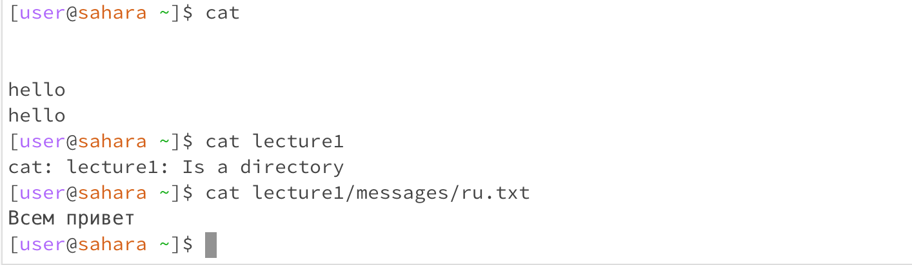

When using cd command with no arguments, the terminal does not change directories. When we use cd with a path to a directory as an argument, this changes our directory to the folder we point it to (in this case we changed directory to lecture 1). This allows us to have a working terminal in lecture1. When we use a file as an argument for cd, we get an error message. This is because our txt file is not a directory and we cannot navigate into them.

When using cat with no arguments the terminal waits for an input from the user. If we enter some random text, cat will output that text back onto the terminal. When using cat with a directory as an argument, the terminal tells us that this is a directory. We are not able to output the contents of the directory. When we use cat with a file as an argument, the contents of the file are displayed on the terminal.

When using the ls command with no arguments, the terminal outputs lecture1, this is because this is the only file inside the current working directory (home). When using ls with a path to a directory as an argument (in this case we used lecture1) we are given all the contents and files included in the directory of lecture1. When we use ls with a file as an argument, the directory is returned. This is because If the pathname is a file, ls displays information about the file.
